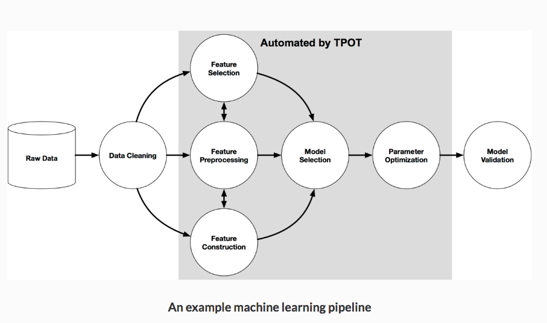

# auto-ml Titanic Example with datmo (SDK)

### SDK

#### 1. Kaggle Titanic Competition

##### a. Introduction

This tutorial is using the "Getting Started" competition from Kaggle's [Titanic competition](https://www.kaggle.com/c/titanic) to showcase how we can use Auto-ML along with datmo, in order to track our work and make machine learning experiments reproducible and reusable. Some part of data analysis is inspired from this [kernel](https://www.kaggle.com/sinakhorami/titanic-best-working-classifier).

##### b. Installation
To use `datmo`, you can install it using `pip install datmo`. If you have trouble installing, try checking the prerequisites listed [here](https://github.com/datmo/datmo#requirements).

To run the `experimentation.ipynb` file, install the prerequisite libraries by running `pip install -r requirements.txt`. Also, install [jupyter notebook](http://jupyter.readthedocs.io/en/latest/install.html) along with browser setup to be able to run it. 

If you're having trouble creating your environment (jupyter and requirements.txt),  `datmo notebook` can be used as shown in [this version of the tutorial](https://github.com/datmo/datmo-tutorials/tree/master/kaggle-titanic/cli).

##### c. Solution

After the installation, we run the `experimentation.ipynb` notebook and perform following steps,

1. Exploratory Data Analysis (EDA)
2. Data Cleaning
3. Using Auto-ML to figure out the best algorithm and hyperparameter

For auto-ml, we use the tpot algorithm, which works as follows,


##### d. Creating versions or snapshots

During the process of EDA, data cleaning and algorithm selection, we will be using datmo to create versions of work by creating datmo snapshots. As you see below, we created three snapshots at the end of the notebook tutorial - One after EDA, and the later two from different versions of our model. More information about the flow can be found in the notebook file.

```bash
home:~/datmo-tutorials/auto-ml$ datmo snapshot ls
+---------+-------------+-------------------------------------------+-----------------+---------------+-------+
|    id   |  created at |                 config                    |   stats         |      message  | label |
+---------+-------------+-------------------------------------------+-----------------+---------------+-------+
| 30f8366b|  2018-05-16 | {u'selected features': [u'Sex', u'Pclass',|{u'accuracy':    |   auto-ml-2   |  None |
|         |   03:04:06  |  u'Age', u'Fare', u'Embarked', u'Title',  |   0.8295964}    |               |       |
|         |             |   u'FarePerPerson', u'FamilySize']}       |                 |               |       |
| adf76fa7|  2018-05-16 | {u'selected features': [u'Sex', u'Pclass',|{u'accuracy':    |   auto-ml-1   |  None |
|         |   01:24:53  |  u'Age', u'Fare', u'Embarked',            |   0.8206278}    |               |       |
|         |             |   u'Fare', u'IsAlone', u'Title']}         |                 |               |       |
| 30803662|  2018-05-15 | {u'features analyzed': [u'Sex',           |    {}           |     EDA       |  None |
|         |   23:15:44  |  u'Pclass', u'FamilySize', u'IsAlone',    |                 |               |       |
|         |             |  u'Embarked', u'Fare', u'Age', u'Title']} |                 |               |       |
+---------+-------------+-------------------------------------------+-----------------+---------------+-------+
```
After we've created snapshots, we can checkout to one of our previous states with the following command:
```bash
home:~/datmo-tutorials/auto-ml$ datmo snapshot checkout --id adf76fa7
```
This reinstates all files present at the time of snapshot creation, available for me to edit and run new tasks, or re-run code as I please.